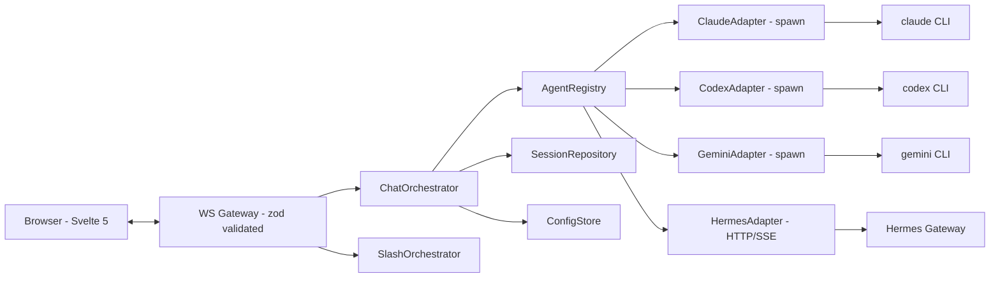

# Agent-Web Architecture

This document is the maintainer-facing map for the project. Keep it aligned with code whenever runtime contracts change.

## Goals

- Local-first control surface for **Claude Code**, **Codex CLI**, **Gemini CLI**, and **Hermes**.
- Browser UI that survives long-running local CLI work, tab switches, and reconnects.
- Explicit runtime contracts so new commands, agents, settings, and recovery behavior can be added without guessing.

## Top-Level Layout

```text
agent-web/
├── server.js                 # bootstrap: load env, build container, start HTTP/WS
├── lib/                      # legacy JS modules (still in production rotation)
│   ├── agent-manager.js
│   ├── agent-runtime.js
│   ├── auth.js
│   ├── codex-rollouts.js
│   ├── config-manager.js
│   ├── notify.js
│   ├── routes.js
│   ├── session-store.js
│   ├── shared-state.js
│   ├── logger.js
│   └── utils.js
├── src/                      # new TypeScript layer (phase 1+ refactor target)
│   ├── core/                 # pure domain types, no IO
│   │   ├── result.ts
│   │   ├── session/session.ts
│   │   └── agent/{agent,registry}.ts
│   ├── adapters/             # one folder per built-in agent
│   │   ├── claude/index.ts
│   │   ├── codex/index.ts
│   │   ├── gemini/index.ts
│   │   ├── hermes/{index,gateway-client,sse-stream,error-mapper}.ts
│   │   └── index.ts          # createBuiltInRegistry(runtime)
│   ├── infra/                # IO / side-effect layer
│   │   ├── persistence/      # SessionRepository, AttachmentRepository, ConfigStore
│   │   ├── process/          # heartbeat (zombie + backpressure), recovery
│   │   ├── transport/ws.ts   # typed WS dispatcher
│   │   └── log/logger.ts
│   ├── application/          # orchestrators (chat / slash / settings)
│   └── shared/               # cross-boundary types: ws-messages, commands
├── web/                      # Vite + Svelte 5 + Tailwind frontend source
│   ├── src/{app,features,lib,ui,styles}
│   └── vite.config.ts        # outDir: ../public
├── public/                   # production-served assets
│   ├── index.html            # new Svelte build
│   ├── assets/               # hashed JS/CSS
│   └── legacy/               # phase-2.5 fallback (?legacy=1)
├── tests/
│   ├── unit/                 # vitest, src/**/*.ts coverage
│   ├── contract/             # adapter contract + WS schema validation
│   └── e2e/                  # Playwright (desktop + iPhone profile)
├── scripts/                  # mock CLIs + regression harness + audit
└── shared/commands.json      # slash command manifest (single source of truth)
```

## Runtime Shape



## AgentAdapter Contract

Defined in [src/core/agent/agent.ts](../src/core/agent/agent.ts). Every agent (built-in or third-party) must implement:

```ts
interface AgentAdapter {
  readonly id: 'claude' | 'codex' | 'gemini' | 'hermes';
  readonly displayName: string;
  readonly capabilities: AgentCapabilities;

  buildSpawnSpec?(session, opts): SpawnSpec | { error: string };
  buildGatewayCall?(session, opts): GatewayCall | { error: string };
  parseEvent(entry, raw, sessionId, emit): void;
  listSlashCommands?(): SlashCommand[];
}
```

**Capabilities** drive the UI:

| Field | Meaning |
|---|---|
| `attachments` | image attachment uploads supported |
| `thinkingBlocks` | reasoning / thinking deltas surface in UI |
| `mcpTools` | MCP tool calls render with server + tool name |
| `permissionModes` | which of `default / plan / yolo` are valid |
| `resume` | `native` (CLI/Gateway resume) / `web-only` / `none` |
| `modelList` | source for the model picker (`cli` / `static` / `gateway`) |
| `conversations` | `gateway` only for Hermes (lists sessions from server) |
| `inlinePermissionPrompts` | UI can surface accept/reject buttons |
| `usage` | `usd` / `tokens` / `both` — drives header display |

The frontend (`web/src/features/...`) reads `capabilities` and renders accordingly. Hard-coded `if (agent === 'claude')` branches are forbidden.

## Built-in Adapter Capability Matrix

See [docs/CAPABILITIES.md](./CAPABILITIES.md).

## Backend Modules (current dual-track)

`server.js` still wires the legacy `lib/*` factories that handle the live runtime. The TS layer in `src/` provides the typed contracts the new code must satisfy. Migration policy:

1. Add new behavior in `src/`.
2. Wrap legacy `lib/` functions in a thin TS adapter (see `src/adapters/*/index.ts`).
3. Once a feature has full coverage in `src/` + tests, the corresponding `lib/` file can be removed.

## Frontend (Vite + Svelte 5 + Tailwind)

Lives under `web/`. Build outputs to `public/`. Key principles:

- **Stores** use Svelte 5 runes (`$state`, `$derived`, `$effect`). See `web/src/lib/stores/`.
- **WS client** is fully typed via `src/shared/ws-messages.ts` zod schemas. Inbound frames are validated; unknown types fall through.
- **Capability-driven UI** — agent-specific rendering decisions read from `capabilities` rather than testing `agent === ...`.
- **Design system** — three layers under `web/src/styles/` and `web/src/ui/`:
  - tokens (`tokens.css`): semantic CSS variables.
  - primitives (`Button`, `IconButton`, `Card`, `Input`, `Sheet`, `Toast`, `Badge`, `Spinner`).
  - patterns (`MessageBubble`, `ToolCallCard`, `ThinkingBlock`, `PermissionPrompt`, `CommandPalette`).

## Slash Commands

There are two command sources:

- **Web commands** — owned by [shared/commands.json](../shared/commands.json) and handled by Agent-Web (see [SlashOrchestrator](../src/application/slash-orchestrator.ts)).
- **Native commands** — parsed live from each CLI's `--help`; safe read commands stream through `spawn`, while TTY/global-mutation commands return terminal-only instructions.

Do not add a new slash command only in the frontend. Update [shared/commands.json](../shared/commands.json) (web) or extend the native CLI mapping in [lib/routes.js](../lib/routes.js) (native), and add regression coverage.

## Runtime Contracts

### HTTP

- `GET /api/health` — diagnostic snapshot (no secrets).
- `GET /api/commands` — slash command manifest.
- `GET /api/slash-completions?agent=...&input=...` — native CLI help-backed completion.
- `POST /api/attachments` — authenticated image upload only.
- Static files served from `public/`. `?legacy=1` redirects to `/legacy/` (phase 2.5 fallback).

### WebSocket

Inbound (validated by `WsInboundCoreSchema`):
- `auth`, `send_message`, `abort`, `list_sessions`, `load_session`, `new_session`, `delete_session`, `rename_session`, `set_mode`, `permission_response`.

Outbound (validated by `WsOutboundCoreSchema`):
- `auth_result`, `text_delta`, `thinking_delta`, `tool_start`, `tool_end`, `turn_done`, `done`, `cost`, `usage`, `error`, `permission_prompt`.

Every streaming event that belongs to a session **must** include `sessionId`. The browser may keep multiple sessions running while viewing one foreground session.

### Session State Invariants

- A session can be running while not foregrounded.
- Logical completion (`turn_done`) may arrive before the child process exits; the UI accepts follow-up input after logical completion.
- Switching sessions does **not** detach an active process.
- Session writes are atomic (`SessionRepository` uses temp file + rename).
- `recoverProcesses()` is idempotent — see `src/infra/process/recovery.ts`.

## Configuration

| Variable | Default | Notes |
|---|---|---|
| `HOST` / `CC_WEB_HOST` | `0.0.0.0` | Bind address |
| `PORT` | `8002` | Bind port |
| `CLAUDE_PATH` | `claude` | Claude CLI path |
| `CODEX_PATH` | `codex` | Codex CLI path |
| `GEMINI_PATH` | `gemini` | Gemini CLI path |
| `CC_WEB_HERMES_API_BASE` | `http://127.0.0.1:8644` | Hermes Gateway base |
| `CC_WEB_HERMES_API_KEY` | empty | Bearer token for Gateway |
| `CC_WEB_CONFIG_DIR` | `./config` | Per-session secrets / model templates |
| `CC_WEB_SESSIONS_DIR` | `./sessions` | Session JSON files |
| `CC_WEB_LOGS_DIR` | `./logs` | Rotating logs |

Runtime-local directories (`config/`, `sessions/`, `logs/`, `attachments/`, `.claude/`, `.codex/`) **must stay out of git**.

## Test Pyramid

```text
tests/
├── unit/        # vitest — pure logic in src/, ~110+ specs
├── contract/    # vitest — adapter capabilities + WS schemas
└── e2e/         # Playwright — login, theme, session lifecycle
```

`npm test` runs `check` + `type-check` + `audit:repo` + `unit` + `regression`. CI additionally runs `npm run e2e` against a server seeded with mock CLIs (phase 3.4).

## Maintainer Checklist

- Is there one source of truth for the changed behavior?
- Can a user inspect the actual runtime state through `/api/health` or logs?
- Are secrets excluded from diagnostics and logs?
- Does the change preserve background running sessions?
- Did `npm test` pass on a clean runtime directory?
- For frontend changes: did `svelte-check --workspace web` pass?
- For Hermes changes: did the SSE consumer + error mapper tests still pass?
